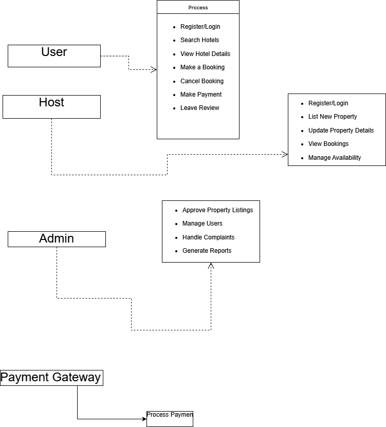

# requirement-analysis

## What is Requirement Analysis?
📌 What is Requirement Analysis?
Requirement Analysis is the process of identifying, gathering, analyzing, documenting, and validating the needs and expectations of stakeholders for a software system. It is one of the most critical phases in the Software Development Lifecycle (SDLC) and serves as the foundation for all subsequent stages like design, development, testing, and deployment.

In simpler terms, requirement analysis ensures that everyone involved in the project (developers, designers, testers, and clients) has a shared and clear understanding of what the software is supposed to do.

🧱 Stages in the Software Development Lifecycle (SDLC)
The SDLC includes the following phases:

Requirement Analysis

System Design

Implementation (Coding)

Testing

Deployment

Maintenance

📍 As the first functional stage, requirement analysis influences every other phase and defines the success or failure of the project.

🎯 Importance of Requirement Analysis
1. Clear Understanding of Stakeholder Needs
Requirement analysis helps uncover the true needs of users and clients. This minimizes miscommunication and ensures that the final product delivers real value.

2. Scope Definition
By defining what the system should and shouldn't do, requirement analysis prevents scope creep—the uncontrolled expansion of project features that can derail timelines and budgets.

3. Foundation for System Design
All system architectures, interfaces, and workflows are built based on documented requirements. Poor or incomplete requirements lead to design flaws.

4. Accurate Cost and Time Estimation
With clear requirements, teams can more accurately estimate the budget, timeline, and resource allocation, reducing the risk of delays and overspending.

5. Quality Assurance
Requirement analysis provides the criteria for validation and testing. If requirements are not clearly defined, it's impossible to verify if the software is functioning correctly.

6. Customer Satisfaction
Well-documented and validated requirements ensure the final product aligns with the customer’s vision, increasing satisfaction and trust.

🔍 Key Activities in Requirement Analysis
Requirement Gathering:

Conducting interviews, surveys, and observations

Analyzing existing systems and documentation

Hosting workshops with stakeholders

Requirement Elicitation:

Extracting true user needs through brainstorming, focus groups, and prototyping

Requirement Documentation:

Writing functional and non-functional requirements

Creating user stories, use case diagrams, and requirement specification documents

Requirement Modeling:

Using data flow diagrams, entity-relationship diagrams, and system models to visualize and understand requirements

Requirement Validation:

Reviewing requirements with stakeholders

Defining acceptance criteria

Ensuring traceability (each requirement can be tracked from design to testing)

🛠️ Types of Requirements
⚙️ Functional Requirements:
Define what the system should do, e.g.:

Login system

Booking process

Search functionality

🛡️ Non-Functional Requirements:
Define how the system should behave, e.g.:

Performance (e.g., load time < 2 seconds)

Security (e.g., data encryption)

Usability, scalability, reliability

## Why is Requirement Analysis Important?
1. ✅ Establishes a Clear Understanding Between Stakeholders and Developers
Description:
Requirement analysis ensures that all parties—clients, users, project managers, and developers—have a shared and accurate understanding of what the system should do. It reduces ambiguity and misunderstandings.

Why it's critical:
Without clear requirements, developers may build a system that doesn’t meet user needs, leading to rework, dissatisfaction, and wasted resources.

2. 🛑 Prevents Scope Creep
Description:
By clearly defining what features and functions are within the project scope, requirement analysis helps prevent scope creep—the uncontrolled addition of features during development.

Why it's critical:
Scope creep can cause delays, increase costs, and derail the entire project. A well-analyzed requirement set helps teams stay focused on agreed-upon goals.

3. 💰 Improves Cost, Time, and Resource Estimation
Description:
With detailed and validated requirements, project teams can accurately estimate the time, budget, and manpower needed for each development phase.

Why it's critical:
Poor estimation due to unclear requirements often leads to budget overruns, missed deadlines, and inadequate resource allocation.

## Key Activities in Requirement Analysis
1. 📥 Requirement Gathering
Collects raw information from stakeholders about what they need from the system.

Involves techniques such as:

Interviews with clients and users

Surveys and questionnaires

Workshops for group discussions

Observation of users in their work environment

Document analysis of current systems or processes

Goal: Build a comprehensive list of potential requirements.

2. 🧠 Requirement Elicitation
Focuses on clarifying and refining the information gathered.

Helps uncover hidden, conflicting, or misunderstood needs.

Common techniques include:

Brainstorming sessions to generate ideas

Focus groups with selected stakeholders

Prototyping to help users visualize the product and clarify needs

Goal: Discover the true needs and expectations behind the initial input.

3. 📝 Requirement Documentation
Converts gathered and elicited information into clear, structured, and written form.

Ensures consistency, traceability, and ease of reference throughout the project.

Common documentation formats:

Software Requirement Specification (SRS) documents

User stories written from the user's perspective

Use cases and use case diagrams showing interactions between users and the system

Goal: Create a single source of truth for all project requirements.

4. 📊 Requirement Analysis and Modeling
Involves examining and organizing the documented requirements for better understanding and implementation.

Activities include:

Prioritizing requirements based on business value and feasibility

Feasibility analysis to ensure the project is technically and financially doable

Modeling using diagrams like:

Data Flow Diagrams (DFDs)

Entity-Relationship Diagrams (ERDs)

Process Models or System Architecture Diagrams

Goal: Ensure the requirements are complete, consistent, and realistic.

5. ✅ Requirement Validation
Ensures the documented requirements correctly represent stakeholder needs and are ready for design and development.

Techniques used:

Stakeholder reviews and walkthroughs

Defining acceptance criteria for each requirement

Requirement traceability matrices to ensure coverage in design and testing

Goal: Confirm that requirements are accurate, feasible, and agreed upon by all parties.

## Types of Requirements
### 1. Functional Requirements
Definition:
Functional requirements define what the system should do — the specific features, behaviors, and functions the software must support.

Examples for Hotel Booking Management System:

User Registration and Authentication:
Users must be able to sign up using email or phone and log in securely.

Search and Filter Properties:
Users can search for hotels based on location, date, price, rating, and availability.

Booking Management:
Users can:

View room details

Select dates and number of guests

Book rooms

Cancel or modify bookings

Host Features:
Hosts can:

List new properties

Upload images and descriptions

Manage availability and pricing

View bookings and earnings

Payment Integration:
Integration with payment gateways (e.g., Stripe, Razorpay) to enable secure online payments.

Notification System:
Email/SMS confirmations for bookings, cancellations, and reminders.

### 2. Non-functional Requirements
Definition:
Non-functional requirements define how the system performs rather than what it does. These include system qualities like speed, security, and scalability.

Examples for Hotel Booking Management System:

Performance:

The system should return search results in less than 2 seconds.

Should handle up to 10,000 concurrent users during peak hours.

Scalability:

The system should scale horizontally to support growth in users, listings, and bookings.

Microservices architecture should allow individual components (e.g., booking or payment service) to scale independently.

Security:

Use HTTPS for secure data transmission.

All sensitive data (e.g., user credentials, payment info) should be encrypted.

Implement role-based access control for users, admins, and hosts.

Reliability and Availability:

System uptime should be 99.9% or higher.

Booking service must ensure no double-booking or lost reservations during outages.

Usability:

The user interface should be intuitive for both desktop and mobile platforms.

First-time users should be able to complete a booking within 5 minutes without assistance.

Maintainability:

Codebase should follow clean code principles and be modular to allow easy updates or feature additions.

## Use Case Diagrams

 What Are Use Case Diagrams?
Use Case Diagrams are a type of behavioral diagram used in Unified Modeling Language (UML) that visually represent how different users (called actors) interact with a system to achieve specific goals (called use cases). They provide a high-level overview of the system’s functionality from the user’s perspective.

Each use case diagram typically includes:

Actors: External entities (like users or other systems) that interact with the system.

Use Cases: The specific actions or services the system performs in response to an actor’s interaction.

Relationships: Connections between actors and use cases, such as association, include, and extend.

✅ Benefits of Use Case Diagrams
User-Centered Perspective: Helps teams understand what the users expect from the system.

Clear Functional Overview: Offers a visual summary of the system’s capabilities and features.

Improves Communication: Bridges the gap between technical teams and non-technical stakeholders by simplifying complex interactions.

Requirement Validation: Assists in validating functional requirements by showing what the system should do in real-world scenarios.

Identifies System Boundaries: Clarifies what is within the scope of the system and what lies outside of it.

Supports Design Decisions: Helps developers and designers plan architecture by visualizing key interactions early in the SDLC.

## Acceptance Criteria
Acceptance Criteria are specific conditions or rules that a software feature must meet to be accepted by stakeholders (e.g., clients, users, testers). They are written during the requirement analysis phase to ensure that everyone agrees on what "done" looks like for each feature.

🎯 Why Acceptance Criteria Are Important
Clarifies Expectations

Eliminates ambiguity by defining clear, measurable outcomes.

Ensures developers, testers, and stakeholders have the same understanding of each requirement.

Supports Testing and Validation

Forms the basis for test cases.

Helps QA teams verify if a feature works as intended.

Improves Development Focus

Guides developers to build exactly what’s required — no more, no less.

Reduces the risk of building features that don't match user needs.

Enables Faster Feedback Loops

By having agreed-upon criteria, stakeholders can quickly review and approve features.

Helps with Task Completion and Planning

Allows teams to mark tasks as "done" only when the acceptance criteria are met.

Useful for Agile methodologies like Scrum.

🧾 Example: Acceptance Criteria for the Checkout Feature
(in a hotel booking management system)

Feature: Checkout and Booking Confirmation

Acceptance Criteria:

The user must be able to review their selected room details, dates, and total cost before confirming the booking.

The system must support secure online payment through at least one payment gateway.

If payment is successful, the system must generate a booking ID and show a confirmation screen within 5 seconds.

A booking confirmation email must be sent to the user within 1 minute of successful payment.

If the payment fails, the user must see an error message with the option to retry or cancel the process.

The selected room must be marked as "unavailable" in the database immediately after successful booking.

